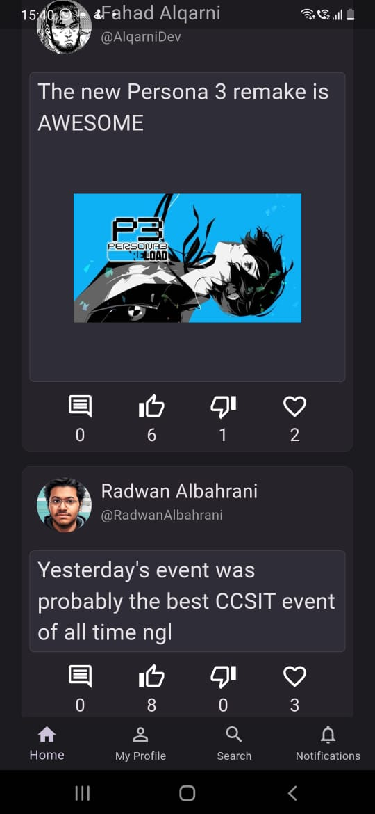
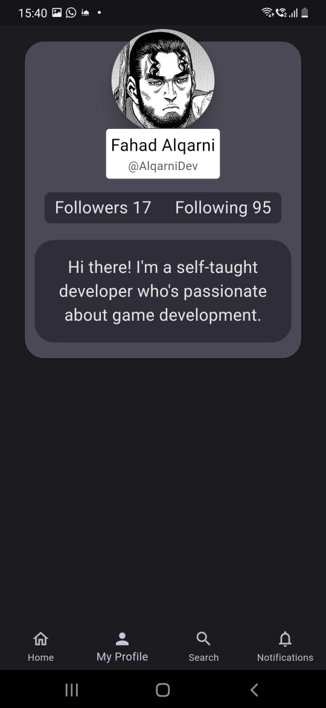
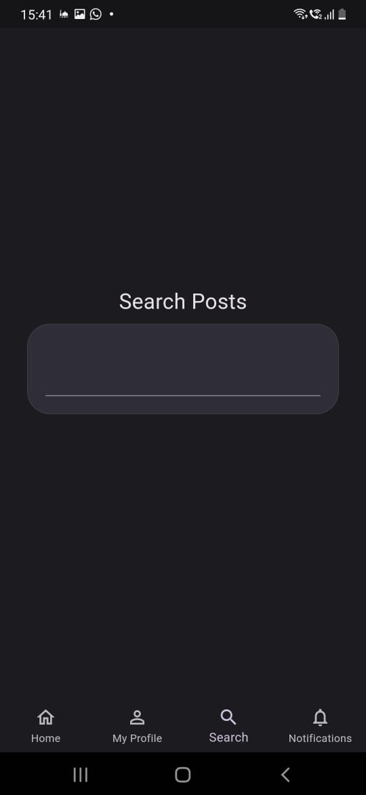
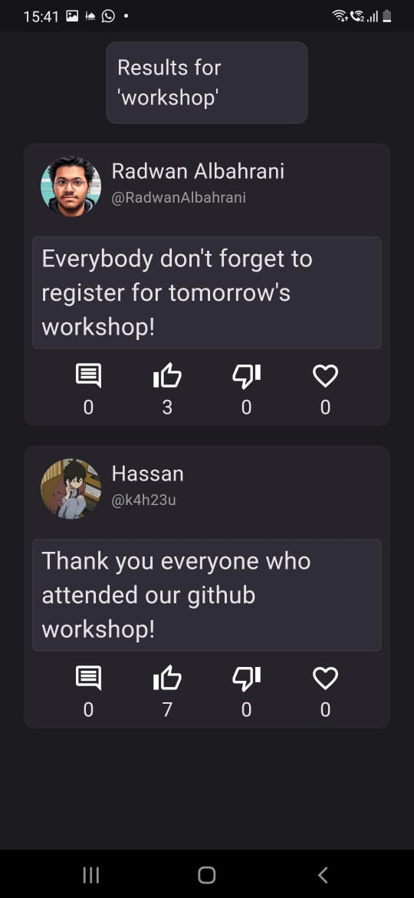
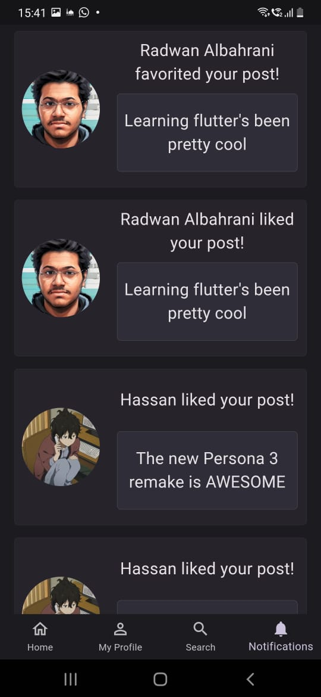

# Fake Social Media App
My implementation of the second task of the GDSC and Programming Club Flutter tasks.
As requested, the app has 4 main pages, as well as inner pages to inspect posts and profiles.

### Home Page

### Profile Page

### Search Page and Functionality

### The Notifications Page

### Models
The app uses 2 main models, the user model, and the post model. The "users.dart" and "posts.dart" files are essentially like big storage files to declare models so that it can make the process of adjusting the app much easier. It contains frequently used user models and post models respectively.
